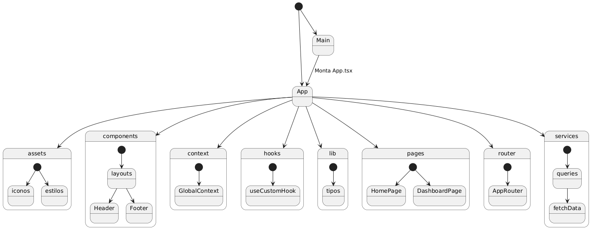
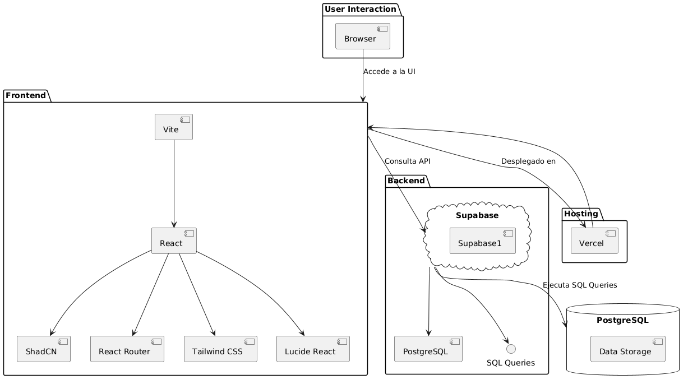

## ✨ Sistema de Gestión de Biblioteca ✨
[https://biblioteca-uneat.vercel.app](https://biblioteca-uneat.vercel.app)

[](https://tu-proyecto.vercel.app/)  
[](https://supabase.com/)

## Descripción

Este proyecto es una aplicación web moderna para la gestión de bibliotecas. Permite realizar préstamos, devoluciones y gestionar usuarios de forma eficiente, combinando una interfaz intuitiva con un backend escalable basado en Supabase.

## Tecnologías

### Frontend

- **[Vite](https://vitejs.dev/):** Para un entorno de desarrollo rápido y eficiente.
- **[React](https://reactjs.org/):** Biblioteca principal para construir interfaces de usuario.
- **[ShadCN](https://shadcn.dev/):** Componentes reutilizables y accesibles.
- **[React Router](https://reactrouter.com/):** Navegación y manejo de rutas.
- **[Tailwind CSS](https://tailwindcss.com/):** Estilizado moderno y utilitario.
- **[Lucide React](https://lucide.dev/):** Íconos personalizados para mejorar la experiencia visual.

### Backend

- **[Supabase](https://supabase.com/):** Plataforma de backend como servicio basada en PostgreSQL.
- Consultas personalizadas en **SQL** para acceso a datos.

### Hosting

- **[Vercel](https://vercel.com/):** Hosting rápido y escalable para el frontend.

---

## Características

- **Gestión de Préstamos:** Sistema eficiente para registrar y devolver libros.
- **UI Moderna:** Diseño responsivo y atractivo con componentes accesibles.
- **Autenticación:** Implementada a través de Supabase para gestionar usuarios y permisos.
- **Páginas Principales:**
    - **Login:** Pantalla inicial para autenticación de usuarios.
    - **Home:** Panel principal con acceso a funcionalidades de la biblioteca.
- **Optimizado:** Construido con Vite y Tailwind para alto rendimiento y carga rápida.

---

## Diagramas

### Diagrama de Arquitectura



### Estructura del Proyecto



---

## Instalación y Uso

1. Clonar el repositorio:
    ```bash
    git clone https://github.com/pablarce/Biblioteca-front.git
    ```
2. Instalar las dependencias:
    ```bash
    cd tu-repo
    pnpm i
    ```
3. Configurar las variables de entorno:
    - Crear un archivo `.env` en la raíz del proyecto.
    - Agregar las claves de acceso de Supabase y Vercel.
4. Iniciar el servidor de desarrollo:
    ```bash
    pnpm dev
    ```

---

## Estructura del Proyecto

```plaintext
src/
├── components/       # Componentes reutilizables
├── pages/            # Páginas principales
├── routes/           # Configuración de rutas
├── styles/           # Estilos globales
├── utils/            # Funciones auxiliares
```

---

## Contribución

¡Contribuciones son bienvenidas! Por favor:

- Haz un fork del proyecto.
- Crea una rama con tu feature: `git checkout -b feature/mi-feature`.
- Envía un pull request.

---

## Licencia

Este proyecto está licenciado bajo la [MIT License](LICENSE).

---

## Demo

Visita la aplicación desplegada en [https://biblioteca-uneat.vercel.app](https://biblioteca-uneat.vercel.app).

---

## Recursos

- [Guía de Inicio con Supabase](https://supabase.com/docs)
- [Documentación de React](https://reactjs.org/docs/getting-started.html)
- [Guía de Tailwind](https://tailwindcss.com/docs)
